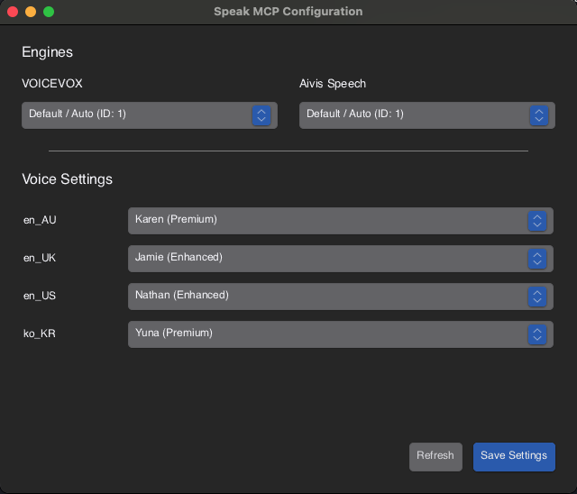

# speak-mcp

A [Model Context Protocol (MCP)](https://modelcontextprotocol.io/) server for text-to-speech.
Enables MCP clients (Claude Desktop, Claude Code, LM Studio, Google Antigravity, etc.) to synthesize speech locally using multiple TTS engines.

> 🇯🇵 [日本語版 README はこちら](README_ja.md)

The Japanese README (`README_ja.md`) is preserved as it was in the original upstream repository. It has not been updated to reflect the changes documented here.

## Supported Engines

| Engine | Port | Requirements |
|---|---|---|
| **macOS `say`** | — | Built-in; configure installed voices per locale. |
| **VOICEVOX** | 50021 | [voicevox.hiroshiba.jp](https://voicevox.hiroshiba.jp/) |
| **Aivis Speech** | 10101 | [aivis-project.com](https://aivis-project.com/) |

## Installation

From the source directory, use the Makefile targets below. Requires [Rust](https://rustup.rs/) (stable). SpeakConfig.app and macOS speech require macOS.

```bash
make config       # Create config.json if it does not exist
make install      # Build and install both the server and app
```

| Target             | Action                                                                          |
| ------------------ | ------------------------------------------------------------------------------- |
| `make`             | Show available targets.                                                         |
| `make build`       | Build the release server binary.                                                |
| `make build-app`   | Build and package SpeakConfig.app.                                              |
| `make config`      | Create `~/.config/speak-mcp/config.json`; refuse to overwrite an existing file. |
| `make install-mcp` | Build and overwrite `~/.local/bin/speak-mcp`.                                   |
| `make install-app` | Build, package, and overwrite `/Applications/SpeakConfig.app`.                  |
| `make install`     | Run both installation targets.                                                  |

Installation does not modify Claude, Codex, OpenCode, LM Studio, or other MCP client settings. Register the server manually. The legacy `install.sh` is disabled and performs no installation actions.

### Manual MCP Configuration

For clients using the `mcpServers` format, add the following to your client's config using your absolute installation path:

```json
{
  "mcpServers": {
    "speak": {
      "command": "/path/to/speak-mcp"
    }
  }
}
```

Default server install path: `~/.local/bin/speak-mcp`. Other clients may use a different configuration format.

## Available Tools

| Tool             | Description                                               |
| ---------------- | --------------------------------------------------------- |
| `speak`          | Queued macOS speech using a required locale (macOS only). |
| `speak_voicevox` | VOICEVOX TTS                                              |
| `speak_aivis`    | Aivis Speech TTS                                          |

### macOS Speech

`speak` accepts required `text` and `locale` strings and an optional positive integer `speed` (words per minute). There is no `voice` argument or default locale.

```json
{"text": "Hello, this is a speech test.", "locale": "en_US", "speed": 180}
```

The tool description lists `en_US`, `en_AU`, `en_UK`, and `ko_KR`. Voice selection comes exclusively from the `locale` object in `~/.config/speak-mcp/config.json`, not a built-in voice mapping. `make config` creates:

```json
{
  "voicevox_default_speaker": null,
  "aivis_default_speaker": null,
  "locale": {
    "en_US": "Nathan (Enhanced)",
    "en_AU": "Karen (Premium)",
    "en_UK": "Jamie (Enhanced)",
    "ko_KR": "Yuna (Premium)"
  }
}
```

Edit this object to change voices or add locale keys without rebuilding the server. Voice names must match installed macOS voices; run `say -v '?'` to list them. Premium and Enhanced voices may need to be installed first, or replaced with an available voice using SpeakConfig.app.

Users can add their own locales directly under `locale`. For example, to add Japanese, keep the existing entries and add `"ja_JP": "Kyoko"` after confirming that this voice is installed. Click **Refresh** in SpeakConfig.app to display the new locale's voice dropdown, then call `speak` with `"locale": "ja_JP"`. No code changes or rebuild are needed. The tool description still lists only `en_US`, `en_AU`, `en_UK`, and `ko_KR`, so tell your agent explicitly when using a custom locale.

Requests return immediately with a queued job ID; playback runs sequentially in FIFO order. Queue acceptance does not confirm successful playback. The worker reads settings at the start of a new playback batch and reuses them until the queue drains. Changes made during playback apply to the next batch. Missing or empty voice mappings and playback failures are logged to stderr, and subsequent jobs continue.

## Building from Source

```bash
git clone https://github.com/veltrea/speak-mcp
cd speak-mcp
make build
```

Requires [Rust](https://rustup.rs/) (stable).

## speak-config

A GUI tool for editing `~/.config/speak-mcp/config.json`.



The **Engines** group retains the VOICEVOX and Aivis Speech speaker selectors in one row. Start those engines to retrieve their speaker lists.

**Voice Settings** shows one dropdown per key in the configuration's `locale` object. Choices come from `say -v '?'`; `en_UK` uses the macOS `en_GB` voice list. Language annotations are hidden in the dropdown labels, while quality labels such as `(Premium)` and `(Enhanced)` remain. The original voice name is retained for saving and playback. A configured voice that is not installed remains visible until you choose a replacement.

**Save Settings** writes the selected voices and engine speaker IDs to the configuration file. **Refresh** reloads the file and both engine and macOS voice lists, discarding unsaved selections. Status messages appear beside the buttons when needed.

```bash
open /Applications/SpeakConfig.app
```

## License

MIT — see [LICENSE](LICENSE)
